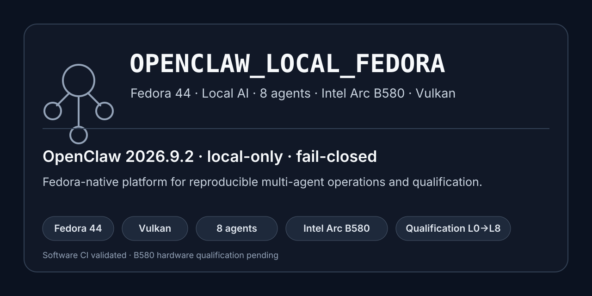
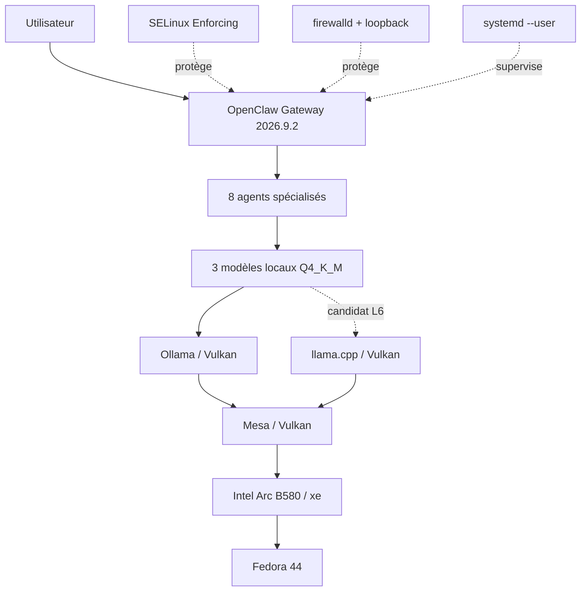

# OPENCLAW_LOCAL_FEDORA

<p align="center">
  
</p>

**Fedora 44 · Local AI · 8 agents · Intel Arc B580 · Vulkan · Fail-closed**

[](https://github.com/mathiasseguincadiche/OPENCLAW_LOCAL_FEDORA/actions/workflows/ci.yml)
[](https://github.com/mathiasseguincadiche/OPENCLAW_LOCAL_FEDORA/actions/workflows/codeql.yml)
[](https://fedoraproject.org/)
[](config/runtime_versions.yaml)
[](pyproject.toml)
[](LICENSE)

Plateforme **Linux-native, LLM local-only et multi-agents** pour exécuter OpenClaw sur Fedora 44 avec une Intel Arc B580, une pile Vulkan explicite, des contrôles fail-closed et une qualification reproductible.

> **État : 0.1.0 — logiciel Fedora validé par CI, qualification matérielle B580 en attente.** Une CI verte prouve la cohérence du dépôt ; elle ne constitue pas un PASS matériel, HARD-40M/L6 ni une approbation V1.

## Pourquoi ce projet ?

`OPENCLAW_LOCAL_FEDORA` vise plus loin qu'une simple démonstration « un LLM tourne en local ». Le dépôt fournit une plateforme complète où **installation, sécurité, routage, agents, exploitation, preuves et qualification** sont traités comme des contrats vérifiables.

- **100 % local pour le routage LLM nominal** — aucun fallback cloud silencieux.
- **8 agents spécialisés** — mêmes missions, workspaces et garde-fous reproductibles.
- **3 modèles locaux Q4_K_M** — flotte nominale explicite, challenger séparé.
- **Fedora-native** — `systemd`, SELinux, firewalld, Podman, KVM/libvirt et `xe`.
- **Vulkan uniquement pour le GPU** — Ollama/Vulkan baseline, llama.cpp/Vulkan candidat L6.
- **Fail-closed** — les incohérences de versions, contrats ou preuves bloquent la progression.
- **Qualification L0 → L8** — la CI logicielle reste strictement distincte des preuves matérielles et de l'approbation humaine.

## État en un coup d'œil

| Domaine | État |
|---|---|
| Architecture V2 Fedora | **Implémentée** |
| CI Fedora 44 | **PASS logiciel** |
| OpenClaw | **`2026.9.2` exact, verrouillé** |
| Parallel | **`2026.9.2` exact, verrouillé** |
| Flotte nominale | **3 modèles locaux Q4_K_M** |
| Agents | **8 rôles spécialisés** |
| Runtime GPU | **Vulkan** |
| Sécurité | **SELinux Enforcing + firewalld + loopback + fail-closed** |
| Qualification B580 L2–L6 | **À exécuter sur la machine réelle** |
| V1 | **Non approuvée** |

Détail de l'état réel : [`STATUS.md`](STATUS.md).

## Architecture



Le chemin supporté est **Fedora 44 → `xe` → Mesa/Vulkan → runtime local**. Aucun autre chemin GPU n'est nominal.

## Flotte et agents

| Alias | Modèle nominal | Missions dominantes |
|---|---|---|
| `qwen-max` | `qwen3.5:9b-q4_K_M` | orchestration, recherche, sécurité, release |
| `gemma-deep` | `gemma4:12b-it-q4_K_M` | architecture, documentation, audit |
| `devstral-devops` | `hf.co/mistralai/Ministral-3-14B-Reasoning-2512-GGUF:Q4_K_M` | DevOps, code, réparation, tool-calling |

Les huit agents sont `chef-operations`, `expert-recherche`, `architecte-solutions`, `ingenieur-devops`, `ingenieur-securite`, `ingenieur-release-forges`, `redacteur-technique` et `auditeur-qualite`.

`granite4.2:8b-q4_K_M` reste un challenger DevOps **hors routage** et ne compte pas comme quatrième modèle nominal.

Sources de vérité : [`config/model_catalog.yaml`](config/model_catalog.yaml) et [`docs/MULTI_AGENT_CORE.md`](docs/MULTI_AGENT_CORE.md).

## Installation rapide

Prérequis : Fedora 44 Workstation, SELinux Enforcing et une session utilisateur normale.

```bash
git clone https://github.com/mathiasseguincadiche/OPENCLAW_LOCAL_FEDORA.git
cd OPENCLAW_LOCAL_FEDORA

./menu.sh --action validate
./menu.sh --action install
./menu.sh --action install --apply
./menu.sh --action health
```

Le premier `install` est un **dry-run**. L'installation réelle converge OpenClaw vers **exactement `2026.9.2`** ; toute autre version est refusée.

Guide complet : [`docs/INSTALLATION.md`](docs/INSTALLATION.md).

## Parcours de documentation

Il n'existe **qu'une seule documentation et un seul parcours**. Une personne peut partir sans connaissance préalable et avancer progressivement jusqu'à l'architecture, l'exploitation DevOps et la qualification complète.

**Commencer ici : [`docs/README.md`](docs/README.md).**

```text
Premiers pas
→ Installation
→ Exploitation
→ Dépannage
→ Architecture
→ Multi-agents
→ Moteur projet
→ systemd
→ Cycle de vie
→ B580 / Vulkan
→ Kernel
→ Upgrade
→ Qualification
→ Roadmap
→ État réel
```

Accès directs utiles :

| Besoin | Document |
|---|---|
| premiers pas | [`docs/GETTING_STARTED.md`](docs/GETTING_STARTED.md) |
| installation | [`docs/INSTALLATION.md`](docs/INSTALLATION.md) |
| exploitation | [`docs/OPERATIONS.md`](docs/OPERATIONS.md) |
| dépannage | [`docs/TROUBLESHOOTING.md`](docs/TROUBLESHOOTING.md) |
| upgrade | [`docs/UPGRADE.md`](docs/UPGRADE.md) |
| architecture | [`docs/ARCHITECTURE.md`](docs/ARCHITECTURE.md) |
| qualification | [`docs/QUALIFICATION.md`](docs/QUALIFICATION.md) |

Ces liens sont des raccourcis de consultation ; ils ne créent pas de parcours séparés.

## Qualification

```text
L2 Fedora / hardware
→ L3 B580 / xe / Mesa-Vulkan
→ L4 OpenClaw 2026.9.2 / 8 agents / outils
→ L5 HARD-40M
→ L6 runtime Vulkan / kernel / challenger
→ L7 Golden Projects
→ L8 Release Readiness
→ approbation humaine explicite
```

Le benchmark nominal reste à **8192 tokens**. Les agents OpenClaw disposent de **16384 tokens** pour système, outils et orchestration ; ce budget n'est pas une promotion automatique du benchmark matériel.

Procédure : [`docs/QUALIFICATION.md`](docs/QUALIFICATION.md).

## Sécurité et invariants

- OpenClaw **exactement `2026.9.2`**, sans mise à jour automatique.
- Parallel **exactement `2026.9.2`**, sans mise à jour automatique.
- SELinux **Enforcing** et firewalld actif.
- Gateway et providers locaux en loopback.
- Base outils agents `minimal`, `exec.mode=ask`, `elevated=false`.
- Aucun fallback LLM cloud silencieux.
- Aucune promotion automatique de kernel, backend, modèle ou V1.
- Les preuves runtime et données lourdes restent hors Git.

Voir [`SECURITY.md`](SECURITY.md) et [`docs/ARCHITECTURE.md`](docs/ARCHITECTURE.md).

## Développement et validation

```bash
make install
make ci
```

GitHub valide Python 3.12/3.13, Ruff, mypy, pytest avec couverture, ShellCheck, les contrats dans un conteneur `fedora:44`, CodeQL et Dependency Review.

## Sources de vérité

| Domaine | Contrat |
|---|---|
| versions | [`config/runtime_versions.yaml`](config/runtime_versions.yaml) |
| OpenClaw | [`config/core/openclaw_policy.yaml`](config/core/openclaw_policy.yaml) |
| modèles | [`config/model_catalog.yaml`](config/model_catalog.yaml) |
| routage | [`config/core/model_routing.yaml`](config/core/model_routing.yaml) |
| outils | [`config/core/tool_policy.yaml`](config/core/tool_policy.yaml) |
| qualification | [`config/qualification_policy.yaml`](config/qualification_policy.yaml) |
| L6 | [`config/optimization_policy.yaml`](config/optimization_policy.yaml) |
| L8 | [`config/release_readiness.yaml`](config/release_readiness.yaml) |

## Licence

MIT.
