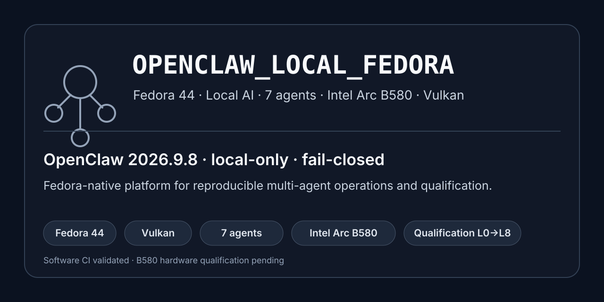
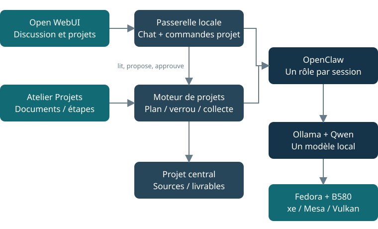

# Atelier IA local — Infrastructure & OPS

<p align="center">
  
</p>

[](https://github.com/mathiasseguincadiche/OPENCLAW_LOCAL_FEDORA/actions/workflows/ci.yml)
[](https://github.com/mathiasseguincadiche/OPENCLAW_LOCAL_FEDORA/actions/workflows/codeql.yml)
[](https://fedoraproject.org/)
[](LICENSE)

**Une IA qui tourne sur son propre PC, pour discuter, apprendre le DevOps et mener des projets sans abonnement.**

## Pourquoi ce projet

Projet personnel. Les abonnements à Claude et ChatGPT sont une dépense récurrente, alors que la machine disponible peut faire tourner un modèle d'IA : Ryzen 7 7700, 48 Go de RAM et Intel Arc B580 de 12 Go, sous Fedora 44. Ce projet l'utilise pour les échanges de tous les jours.

Il accompagne aussi un parcours : passer de l'administration systèmes et réseaux au DevOps, côté déploiement et infrastructure. L'atelier est donc réglé pour expliquer, faire pratiquer et relire, pas seulement pour donner des réponses.

## Ce qu'il fait

| Usage | Interface |
|---|---|
| Discuter et poser n'importe quelle question | Open WebUI, `http://127.0.0.1:3000` |
| Apprendre avec un mentor qui part des acquis de l'utilisateur | Open WebUI ou l'atelier |
| Mener un projet avec sept rôles spécialisés | Atelier Projets, `http://127.0.0.1:18890` |
| Obtenir de vrais fichiers : Markdown, PDF, DOCX, YAML, Terraform, schémas Draw.io | Les deux |

Un seul modèle, **Qwen 3.5 9B**, tourne sur la carte graphique avec Ollama. **OpenClaw** lui donne sept rôles : mentor, recherche, architecte, DevOps, sécurité, rédacteur et auditeur. Ce sont sept jeux de consignes pour le même modèle, pas sept IA en mémoire.



## Ce qu'il ne fait pas

- Il n'égale pas un grand modèle cloud. Un modèle de cette taille explique, relit et rédige bien ; il se trompe plus souvent sur les tâches longues. L'atelier compense par de petites étapes, des sources et de la relecture.
- Il n'exécute rien sur le PC. Les rôles proposent du code et des fichiers ; c'est l'utilisateur qui les exécute.
- Il n'est accessible que depuis ce PC.

## Démarrer

Sur Fedora 44, depuis le compte utilisateur habituel :

```bash
git clone https://github.com/mathiasseguincadiche/OPENCLAW_LOCAL_FEDORA.git
cd OPENCLAW_LOCAL_FEDORA
./menu.sh --action install            # aperçu, ne modifie rien
./menu.sh --action install --apply
./menu.sh --action context-probe --apply   # la carte suit-elle, et à quelle vitesse ?
./menu.sh --action webui-install --apply
```

`./menu.sh --help` liste toutes les actions.

## Documentation

**[Le guide](docs/GUIDE.md)** donne la trame et renvoie vers une fiche par sujet :

| | |
|---|---|
| [Installer](docs/fiches/01-installer.md) | [Rôles et outils](docs/fiches/07-roles-et-outils.md) |
| [Premier essai](docs/fiches/02-premier-essai.md) | [Réglages](docs/fiches/08-reglages.md) |
| [Discuter](docs/fiches/03-discuter.md) | [Entretenir](docs/fiches/09-entretenir.md) |
| [Atelier Projets](docs/fiches/04-atelier-projets.md) | [Dépanner](docs/fiches/10-depanner.md) |
| [Apprendre](docs/fiches/05-apprendre.md) | [Comment ça marche](docs/fiches/11-comment-ca-marche.md) |
| [Fichiers et schémas](docs/fiches/06-fichiers-et-schemas.md) | [Présentation illustrée (PDF)](docs/guide-utilisateur.pdf) |

## État

Le logiciel passe ses tests automatiques, y compris avec le vrai OpenClaw. Il n'a pas encore tourné sur le PC cible : la vitesse, la tenue en mémoire vidéo et la qualité des réponses restent à mesurer. Détail dans [STATUS.md](STATUS.md).

Versions utilisées : OpenClaw 2026.9.8, Ollama 0.35.1, Open WebUI v0.11.4 (image slim). Elles sont fixées dans `config/` et ne se mettent pas à jour seules.

Licence [MIT](LICENSE). Le nom technique du dépôt reste `OPENCLAW_LOCAL_FEDORA`.
