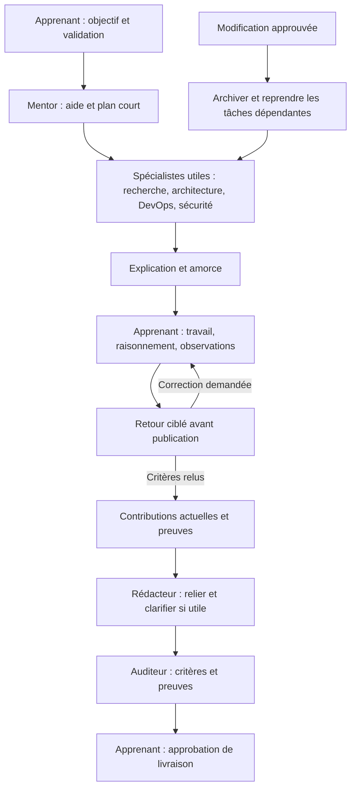

# Sept spécialistes, outils effectifs et pédagogie transversale

L’architecte conçoit les composants, les flux et les schémas. Le rédacteur pédagogique assure la cohérence éditoriale des contributions actuelles. Chaque spécialiste reste responsable d’expliquer son raisonnement à l’apprenant; personne ne délègue toute la pédagogie au rédacteur.

| Rôle | Contribution et accompagnement |
|---|---|
| Mentor infrastructure/OPS | acquis, guidage ciblé, problème, périmètre, prérequis, petites étapes, critères et dépendances |
| Expert recherche | vocabulaire, mécanismes, sources datées, alternatives et incertitudes |
| Architecte | infrastructure, ADR, schémas et compromis liés aux limites matérielles |
| DevOps infrastructure/OPS | méthodes, scripts/configurations proposés, CI, vérification, incident et rollback |
| Sécurité | risques concrets, droits, exposition, secrets et limites des contrôles |
| Rédacteur pédagogique | explications progressives, exemples, liens entre notions et synthèse fidèle |
| Auditeur qualité | sources, critères, intégrité, preuves, clarté et actionnabilité |

Ce schéma décrit un parcours possible, pas sept générations obligatoires. Le worker séquentiel appelle OpenClaw, qui utilise le même Qwen pour chaque spécialité. En mode adaptatif, la rédaction est directe par défaut; une tâche explicitement guidée attend le travail de l’apprenant. Si aucune synthèse n’est nécessaire, les contributions vont directement aux audits.

Tous disposent de lecture, PDF/images et outils web autorisés, recherche locale bornée et trames métier. Les outils effectifs et leurs restrictions sont détaillés dans [SPECIALIST_TOOLING.md](SPECIALIST_TOOLING.md). L’architecte seul dispose du [schéma Draw.io éditable et de son aperçu SVG](DRAWIO.md); DevOps/sécurité/audit des contrôles techniques; le rédacteur du lint Markdown. Les prompts déployés injectent le contrat commun, restent sous 3000 caractères et les fichiers normalement injectés sous 8000 caractères cumulés. Ce budget ne confond pas caractères et tokens: le contexte reste 8192 tokens pour système, outils et échanges.

[LEARNING_WORKFLOW.md](LEARNING_WORKFLOW.md) décrit la pratique guidée, les soumissions humaines et les reprises de dépendances. Six ou sept profils ne signifient pas autant de modèles en VRAM. Un seul Qwen, une génération à la fois, spécialistes sollicités uniquement s’ils sont utiles. Une synthèse peut coûter un appel supplémentaire: utiliser le rédacteur pour un livrable qui a besoin de cohérence, pas pour reformater chaque réponse triviale.

Tous peuvent interpréter un rapport CI avec clawfedora_ci_report, sans exécution ni authentification automatique du résultat. Voir [les contrôles infrastructure](INFRASTRUCTURE_CHECKS.md).

Tous peuvent aussi produire de vrais documents Markdown/TXT/PDF/DOCX avec `clawfedora_artifact`. L’architecte, le DevOps et la sécurité peuvent générer configurations, scripts et templates dans leur format technique. Le chat fournit des liens de téléchargement; les projets conservent source, relecture et exports cohérents. Voir [les formats et le parcours de livraison](FILE_OUTPUTS.md).
