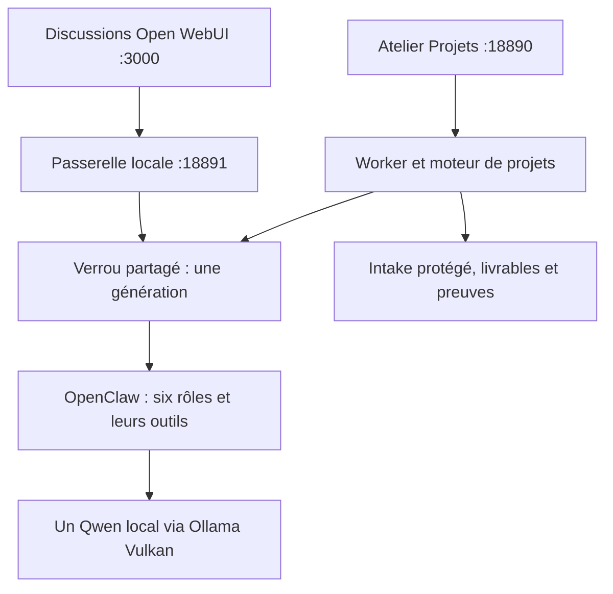

# Open WebUI et atelier Projets

Intégration personnelle pour Fedora 44, Ryzen 7 7700, 48 Gio RAM et Arc B580 12 Gio. Open WebUI est une interface de discussion; l’atelier garde la gestion des documents, plans, tâches, audits et livraisons. Les six spécialités utilisent toujours un seul Qwen 9B. Le choix de spécialiste ne charge pas six modèles.

## Installer et ouvrir

Après installation du profil quotidien ou migration vers cette version du dépôt, avec le compte Fedora habituel:

```bash
./menu.sh --action webui-install --apply
```

Ou, pour une installation complète avec cette option:

```bash
scripts/linux/10_install_full.sh --apply --with-webui
```

Ouvrir **Atelier IA Fedora** dans les applications, ou les adresses:

- Projets: <http://127.0.0.1:18890>.
- Discussions: <http://127.0.0.1:3000>.

Créer le premier compte administrateur dans Open WebUI puis fermer les inscriptions:

```bash
./menu.sh --action webui-seal --apply
```

Cette action arrête le conteneur, vérifie qu’il existe exactement un administrateur, conserve les conversations et la clé de session, puis redémarre avec les inscriptions désactivées. L’adresse du compte est locale; aucun mail n’est envoyé. Le profil vise une seule personne. Le compte administrateur peut modifier sa propre installation: les options d’interface ne sont pas un sandbox contre cet administrateur.

## Un seul chemin d’inférence



La passerelle utilise le même client OpenClaw, les mêmes vérifications de versions, identité du modèle, roster et interdictions d’outils que le worker. Elle n’expose pas le jeton opérateur du gateway et ne configure aucun accès direct Ollama dans Open WebUI. Le endpoint HTTP chat natif du gateway n’est pas activé: la passerelle appelle le client natif géré. Aucun second orchestrateur ni queue de projets.

Une conversation active ou un worker actif exclut toute autre génération. L’interface reçoit un message d’occupation; le modèle n’est pas relancé en parallèle. Le mode jeu bloque l’inférence même si les interfaces restent consultables. Lecture des états et liste des modèles restent disponibles pendant une génération.

Les réponses sont **mises en tampon**: Open WebUI attend la fin de la génération et reçoit alors une réponse compatible SSE. Aucun affichage token par token dans cette version. Fermer l’onglet ou arrêter la réception dans WebUI ne libère pas le verrou tant que le client OpenClaw travaille. Le bouton d’arrêt du chat ne garantit pas l’annulation de l’inférence native; attendre sa fin avant le mode jeu ou la maintenance. Chaque tour utilise une session neuve; l’historique envoyé par WebUI porte le contexte, sans le doubler dans une session persistante. Limites: 20 messages, 6000 octets d’historique, sortie quotidienne plafonnée à 1024 tokens. Ouvrir un nouveau chat lorsque l’historique dépasse la limite; les anciens échanges restent conservés.

## Piloter un projet sans rédiger de JSON dans un terminal

1. Dans l’atelier, saisir titre, demande, contraintes et résultats attendus; joindre au plus trois documents (8 Mo au total). Les noms entrants servent seulement de libellés; les fichiers ont des noms générés par le serveur.
2. Ouvrir le projet et demander le cadrage au chef. Il reçoit un snapshot et doit lire les sources, y compris avec `pdf` ou `view_image` lorsque nécessaire. Aucun statut ne progresse à partir d’une simple proposition.
3. Actualiser le dossier, corriger le formulaire, contrôler la couverture déclarée des sources et approuver. Une extraction, un nom de fichier ou une déclaration IA ne prouvent pas à eux seuls une lecture complète. Les limites doivent rester dans les informations manquantes et l’auditeur doit vérifier les sources. Répondre aux questions bloquantes.
4. Demander un plan court, corriger rôles, objectifs, dépendances, sorties et critères; approuver explicitement. Le moteur vérifie la couverture, les clarifications et les dépendances. La proposition devient le plan assigné.
5. Démarrer les tâches, une à la fois. Le collecteur seul écrit les sorties attendues. Demander une pause pour arrêter après la tâche active.
6. Lancer séparément validation puis relecture. Un FAIL ne livre pas le projet; consulter les constats et reprendre par le moteur existant. Les audits ne lancent pas les scripts proposés sur l’hôte. L’exécution réelle reste à l’opérateur ou à un environnement qualifié.
7. Télécharger documents, livrables et preuves; approuver la livraison finale seulement après les audits PASS et la vérification du package.

Les pièces jointes d’un chat ne deviennent pas automatiquement des sources de projet. Utiliser l’import de l’atelier pour conserver hashes, provenance et gates. Une discussion n’a aucun pouvoir de transition sur les projets. Les gros dossiers, archives et opérations de reprise avancées gardent l’intake/moteur CLI existant.

## Ressources et isolation

Image **v0.11.4-slim**, figée par digest dans `config/webui_policy.yaml`, sans Ollama embarqué, embeddings, reranker ou voix locale. Podman rootless; un worker web, limite 3 Gio RAM, 2 CPU, 256 processus, capacités Linux retirées et `no-new-privileges`. Pas de GPU, socket Podman/Docker ou répertoire personnel monté. Seul `state/webui/data` est monté, avec le label SELinux privé `:Z`.

Le réseau hôte permet d’atteindre la passerelle sur loopback. `HOST=127.0.0.1` est explicite: ce choix partage le réseau de l’hôte et n’apporte pas d’isolation réseau. Aucun port firewall n’est ouvert. Ce profil personnel n’est pas un déploiement multi-utilisateur ou Internet.

Le catalogue d’outils internes envoyé par Open WebUI est ignoré par la passerelle; seuls le rôle validé et l’historique texte deviennent un prompt OpenClaw. Les outils effectifs restent ceux du workspace.

Les titres/tags/suggestions automatiques, automations, sous-agents WebUI, arena, exécution de code, images, recherche WebUI et accès direct Ollama sont désactivés. La recherche Internet utile reste celle des agents OpenClaw. `ENABLE_PERSISTENT_CONFIG=false` réapplique les réglages gérés au redémarrage; un administrateur peut néanmoins modifier sa session en cours. Les outils des agents sont décrits dans [AGENT_TOOLS.md](AGENT_TOOLS.md).

La limite mémoire concerne le conteneur serveur, pas le navigateur ni Ollama. C’est un budget initial, pas une mesure ni une garantie. Observer `podman stats clawfedora-webui` pendant un chat long et une livraison de projet; comparer RAM, fluidité GNOME et jeu avec/sans l’interface. Un test de l’image dans l’environnement de revue ne qualifie pas Fedora/B580.

## Arrêt, sauvegarde et retour arrière

```bash
./menu.sh --action webui-stop --apply
./menu.sh --action backup
./menu.sh --action webui-start --apply
```

Installation, arrêt, démarrage et fermeture des inscriptions exigent le même verrou que les générations: attendre la fin d’une tâche ou discussion avant une maintenance.

Les données, le jeton d’intégration et la clé de session sont dans `state/webui`; la sauvegarde existante inclut `state` et utilise l’API SQLite pour intégrer les journaux WAL. Pour une sauvegarde cohérente de la base et des fichiers du chat, arrêter WebUI d’abord. Une migration quotidienne arrête les interfaces avant la sauvegarde puis reconverge le module s’il était installé. La désinstallation désactive ses services et conserve les données sauf purge explicitement demandée.

Pour annuler l’option, arrêter WebUI et désactiver ses deux unités utilisateur; l’atelier et le moteur de projets restent utilisables. Ne pas supprimer la clé de session pour effectuer une mise à jour. Pour changer l’image, sauvegarder, modifier le contrat volontairement et vérifier la compatibilité de la base; ne pas utiliser un tag roulant. En cas d’échec de migration, les services restent arrêtés: consulter [UPGRADE.md](UPGRADE.md).

Sources: [installation et variante slim](https://docs.openwebui.com/getting-started/quick-start/), [release v0.11.4](https://github.com/open-webui/open-webui/releases/tag/v0.11.4), [variables de configuration](https://docs.openwebui.com/reference/env-configuration/), [Podman run](https://docs.podman.io/en/latest/markdown/podman-run.1.html).
