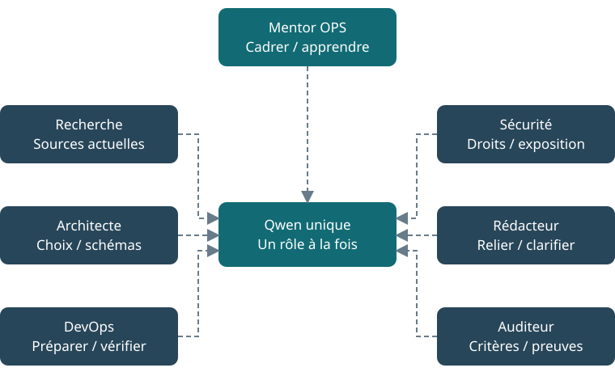

# Rôles et outils

[← Guide](../GUIDE.md)

## Sept rôles, un seul modèle

Un rôle, c'est trois choses autour du même Qwen : des consignes, un espace de travail et une liste d'outils autorisés. Changer de rôle ne charge pas un autre modèle et ne consomme pas plus de mémoire vidéo. Ce qui coûte, c'est chaque appel : un rôle de plus dans un projet, c'est une génération de plus à attendre.



| Rôle | Ce qu'il apporte |
|---|---|
| **Mentor infrastructure/OPS** | Cadre le besoin, part de tes acquis, propose la prochaine petite étape. Entrée par défaut. |
| **Expert recherche** | Trouve des sources récentes, les date, distingue fait et hypothèse. |
| **Architecte solutions** | Compare les options, explique les flux, produit des schémas Draw.io. |
| **Ingénieur DevOps** | Prépare scripts, configurations, pipelines et procédures, avec leur vérification et leur retour arrière. |
| **Ingénieur sécurité** | Examine droits, secrets, exposition réseau et risques concrets. |
| **Rédacteur pédagogique** | Relie les contributions et produit une documentation claire. |
| **Auditeur qualité** | Relit critères, sources et preuves dans une session séparée. Il signale, il ne corrige pas. |

L'auditeur utilise le même Qwen que les autres. Sa session séparée lui évite de reprendre le raisonnement de l'auteur, mais ce n'est pas un second avis indépendant comme le donnerait un autre modèle.

## Ce que tous les rôles peuvent faire

| Outil | Usage |
|---|---|
| Lecture | Lire les fichiers de leur espace de travail, les PDF et les images |
| Recherche Web | Chercher (4 résultats) et lire une page (4 000 caractères) |
| Recherche locale | Retrouver des passages dans les documents du projet |
| Trames | Obtenir un plan type pour leur métier : brief, ADR, runbook, rapport |
| Fichiers | Produire Markdown, texte, PDF et DOCX |
| Rapports de CI | Interpréter un résumé de résultats que tu fournis |

## Ce qui est réservé

| Outil | Rôles |
|---|---|
| Schéma Draw.io | Architecte |
| Fichiers techniques (YAML, Terraform, scripts, Dockerfile…) | Architecte, DevOps, Sécurité |
| Vérification de syntaxe JSON, YAML, Python | DevOps, Sécurité, Auditeur |
| ShellCheck (Bash) et yamllint (YAML) | DevOps, Sécurité, Auditeur |
| PyMarkdown (Markdown) | DevOps, Rédacteur, Auditeur |
| Gitleaks (secrets dans un texte) | Sécurité, Auditeur |

## Ce qu'aucun rôle ne peut faire

- Lancer une commande sur ton PC.
- Écrire ou modifier un fichier directement : ils proposent, un collecteur vérifie puis écrit.
- Ouvrir un navigateur.
- Lancer d'autres rôles de leur propre initiative : c'est l'atelier qui ordonne les tâches.
- Mettre à jour OpenClaw ou modifier sa configuration.

Ces interdictions sont dans `config/core/tool_policy.yaml` et dans la configuration générée par `src/clawfedora/openclaw_config.py`.

## Où sont les consignes

```text
agents/
├── _shared/
│   ├── PEDAGOGY.md    comment accompagner
│   ├── TOOLS.md       comment utiliser les outils
│   └── CONTRACT.md    règles communes : honnêteté, limites, projets
└── <rôle>/
    ├── AGENTS.md      mission et outils du rôle
    ├── IDENTITY.md    nom et fonction
    └── SOUL.md        ligne de conduite
```

À l'installation, le fichier `AGENTS.md` déposé dans l'espace de travail de chaque rôle réunit la pédagogie, la mission du rôle, le guide d'outils et le contrat. C'est ce texte que le modèle reçoit à chaque message.

Si tu modifies ces fichiers, garde-les courts : OpenClaw coupe sans prévenir un fichier qui dépasse la limite fixée dans `config/core/openclaw_policy.yaml`. La commande `./menu.sh --action validate` refuse un dépassement. Redéploie ensuite avec `./menu.sh --action agents`.
